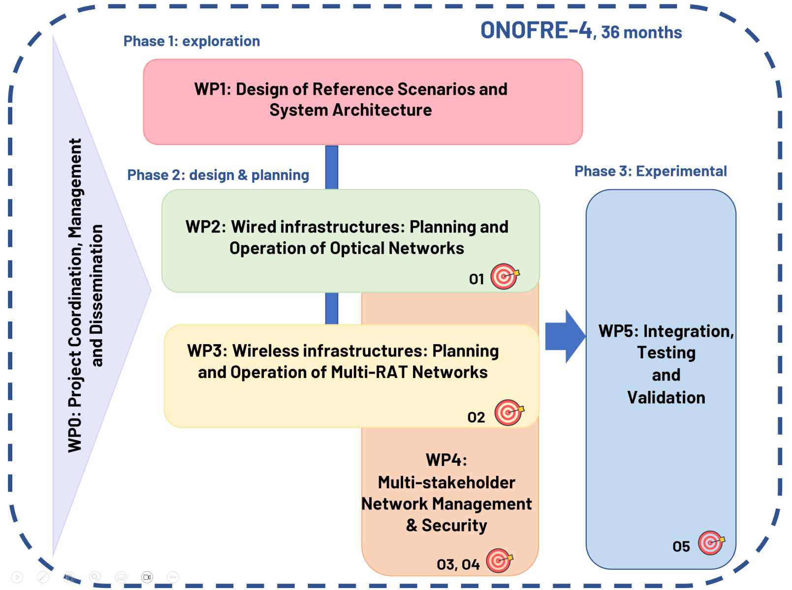

 

<b>ONOFRE-4</b> (Multi-stakeholder Network Planning and Orchestration for Reliable and Secure Connected Mobility) aims to develop efficient planning and management mechanisms for network infrastructures equipped with computing resources. The focus is on providing support for connected, reliable and secure mobility, with special consideration given to the interrelation between networks operated by different actors.

In concrete terms, the project starts from the assumption that to fully exploit the potential of connected mobility in general, it is essential to
have <b>robust and reliable communication infrastructures</b>, both wired and wireless, <b>equipped with computing resources</b>, and supported by
<b>effective orchestration procedures</b>. It also highlights the importance of considering <b>multi-operator and even multi-stakeholder scenarios</b>. As
vehicles move across different geographical regions, networks managed by different operators and their associated computing resources
should facilitate seamless connectivity and uninterrupted access to subscribed services, thus contributing to a more connected and
cohesive mobility ecosystem. In addition, communication and computing infrastructures of different operators, and even of other actors
such as public administrations, companies or industries, may exist in the same geographical area. Therefore, the interrelation of these
infrastructures, enabling a shared use of resources under certain conditions, and articulated through smart contracts, will enhance
efficiency in service provision and create new opportunities for operators and other stakeholders.

<b>ONOFRE-4</b> will advance on: 
<ul>
<li>(1) providing efficient planning and management mechanisms for wired and wireless network infrastructures
equipped with computing resources, </li>
<li>(2) optimizing the use of multiband technologies and coherent pluggable transceivers in optical
networks, along with a focus on emerging standards on access networks, </li>
<li>(3) optimizing the co-existence of multiple radio access
technologies (RAT) with special emphasis on recently introduced techniques such as multi-channel operation (MCO), </li>
<li>(4) optimizing the services
offered by the network and its computing infrastructure, exploiting orchestration, federated learning and computation offloading in multistakeholder
environments, </li>
<li>(5) improving the reliability and security of the network architecture by including identity management and
quantum key distribution (QKD), </li>
</ul> and all with a focus on improving various use cases related to mobility.

<b>Objectives:</b>

<ul>
<li><b>O1.</b> To propose planning and allocation mechanisms for core, metro and access optical networks, as well as IA-based network automation techniques.</li>
<li><b>O2.</b> To extend the optimization of multi-RAT operation, including recently introduced technologies.</li>
<li><b>O3.</b> To ensure efficient and reliable resource management in complex network infrastructures composed of multiple stakeholders. </li>
<li><b>O4.</b> To enhance the security of the architecture by incorporating identity management, DLT and QKD.</li>
<li><b>O5.</b> To optimize and validate services and use cases related to connected vehicles.</li>
</ul>

 

